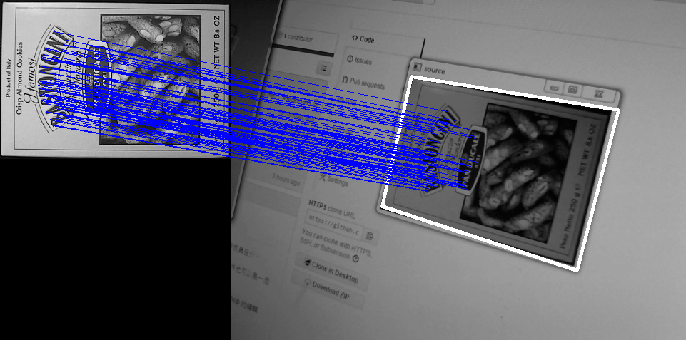

## 拍.電.視.時間

這個專案用來存放拍.電.視.時間用到的所有檔案，包括教學文件、小實驗程式碼、還有成員自介。
較詳細的活動說明目前放在 [Hackpad](https://pycv-time.hackpad.com/...-Python-Computer-Vision-Time-tGKsr12rP66) 上

拍電視時間是免費活動，不過第一次參加的朋友，必須準備一份自我介紹，並且上傳到 PyCV-time/member 資料夾底下，做法大致是：

1. 按右上角的 Fork 按鈕把整份專案複製到你的帳號下
2. 在 member 資料夾底下新增你的自介檔
3. 再向這裡(fatcloud/PyCV-time)提出 pull request

當你的 pull request 被接受以後，
就會被加進共作群組裡，
以後就可以直接 push 更新到這個專案裡面。

自我介紹檔建議存成大家都打得開的 .pdf 或可以線上瀏覽的 .md 說明檔。

### 檔案結構

- challenges 挑戰問題!
- experiments 所有的程式小實驗
- members  成員自介
- temporily-in-a-mess 不要看，很混亂
