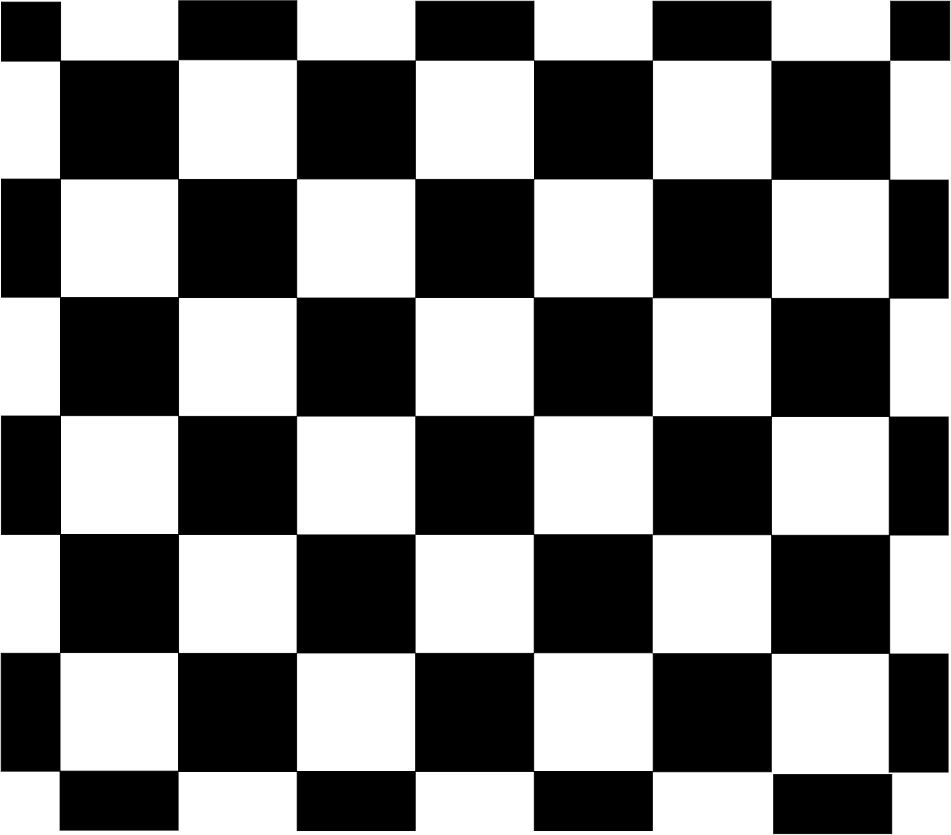

## 3D Pose Estimatiln

#目標 ：Render Cube on the chessboard 

## Calibration 相機校正 <取得參數>
參考：[Python-OpenCV Tutorial](http://opencv-python-tutroals.readthedocs.org/en/latest/py_tutorials/py_calib3d/py_table_of_contents_calib3d/py_table_of_contents_calib3d.html) 
#Step 1.將檔案<Checksboard_8x7.jpg>印出貼在紙板上

※使用其他型式，請改程式內 Chessboard 格點數。
#Step 2.架好你的 Webcam,照 10 張以上的 cheesboard 為主的照片
Ps:檔案請存 jpg 型式

#Step 3.打開 Calibration.py 計算鏡頭參數 
會產出 ret, mtx, dist, rvecs, tvecs 四個.npy檔案
這是 Render Cube 時，所需要的參數。
個別代表的意義請參考 [OpenCV Document](http://docs.opencv.org/doc/tutorials/calib3d/camera_calibration/camera_calibration.html)

#Step 4. 打開 3D_Cube.py 計算鏡頭參數 
