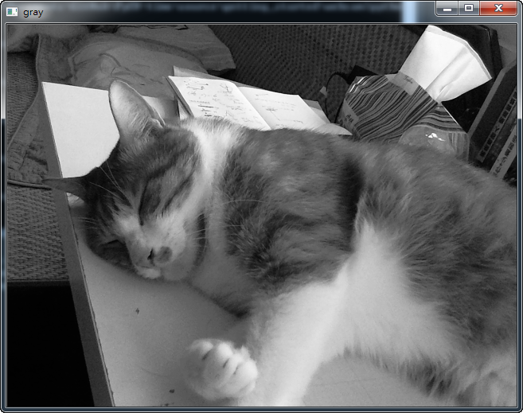
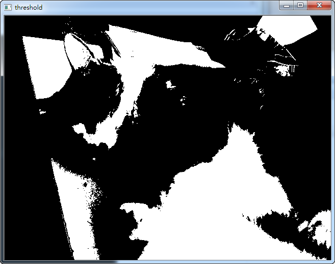

## 使用 Webcam

這個小實驗示範了要如何用 opencv 從網路攝影機讀取影像、
對它做灰階處理、
再顯示到一個視窗上。

### 用法

執行以下命令，就會跳出一個視窗，即時顯示灰階處理後的網路攝影機影像。

	> python webcam.py

畫面如下：

想關閉程式只要隨便按鍵盤上的任意鍵就行了，按右上角的 x 按鈕是沒有用的。

## 程式碼說明

	
首先引入 opencv 2 模組，
然後創造一個 VideoCapture 物件，
參數 0 會啟動連接電腦上的第一台相機相機。

	import cv2
	
	# initialize the video source
	cap = cv2.VideoCapture(0)

接著進入迴圈

	key_code = -1
	
	while(key_code == -1):
	    # Capture frame-by-frame
	    ret, frame = cap.read()
	
	    # image processing functions
	    frame_gray = cv2.cvtColor(frame, cv2.COLOR_BGR2GRAY)
	    
	    # Load the frame into a window named as 'Press any key to exit'
	    cv2.imshow('Press any key to exit', frame_gray)
	    
	    # wait for the key
	    key_code = cv2.waitKey(10)

	
這個迴圈裡的內容不多，

1. ret, frame = cap.read() 讀取影像存到 frame 裡。

2. cv2.cvtColor(frame, cv2.COLOR_BGR2GRAY) 把 frame 的顏色從藍綠紅彩色轉換成灰階。

3. imshow 把影像用一個視窗顯示出來。

4. waitKey(10) 等待鍵盤命令 10ms（如果沒有偵測到任何按鍵信號會回傳 -1）

比較特別的是 imshow 與 waitKey 之間有種神秘的關係，
沒有呼叫 waitKey 之前，
imshow 只會創造視窗，不會顯示出任何畫面來。

	# When everything done, release the capture
	cap.release()
	cv2.destroyAllWindows()

最後，
cap.release() 關閉相機，
cv2.destroyAllWindows() 關閉所有視窗

## 練習

在 cvtColor 那行程式之後，
用 threshold 函數把灰階處理過的影像 frame\_gray 依據亮度門檻調成黑白影像 frame\_thm

	ret, frame_th = cv2.threshold(frame_gray,127,255,cv2.THRESH_BINARY)

同時要記得把 imshow 的輸出影像 frame\_gray 也改成被處理過的 frame\_th

	cv2.imshow('Press any key to exit', frame_th)

這樣就可以看到以下畫面

試著改變 threshold 函數裡的其它參數，
像是 127 這個門檻值可以改成 0 ~ 255 之間的任意數字，
處理模式 THRESH\_BINARY 也可以改成 THRESH\_BINARY\_INV 或 THRESH\_TRUNC，
詳見 [api 文件](http://docs.opencv.org/modules/imgproc/doc/miscellaneous_transformations.html#threshold)